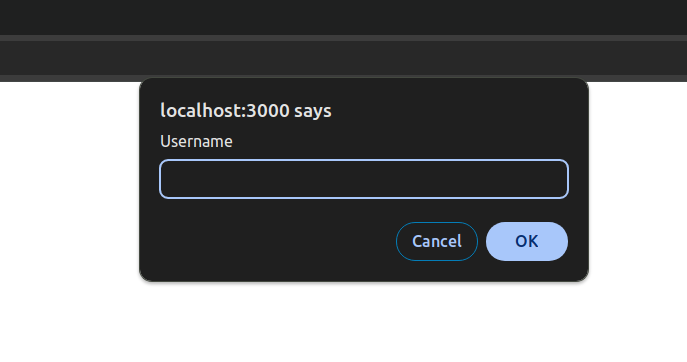

# react-app-protect

[](https://www.npmjs.com/package/react-protected-app)

Protect your react application with simple Username and Password prompt (not a replacement for basic auth), which looks like `htpassword` from Apache server.

> Uses _base64_ to encrypt the password.

> Stores the encrypted credentials in the localStorage.

> Checks if the stored credentials is valid against generated credentials.

# Usage

## 1. Install

```bash
npm install --save react-protected-app
yarn add react-protected-app
```

## 2. Wrap Root Component

```jsx
import React from "react";
import { Router, Route, Routes } from "react-router-dom";
import Home from "./Home";
import Protected from "react-protected-app";

function App() {
  return (
    <Protected>
      <Router>
        <Routes>
          <Route path="/" element={<Home />} />
        </Routes>
      </Router>
    </Protected>
  );
}

export default App;
```

## 3. Generate Protected Credentials

Run following command to generate encrypted credentials:

```bash
$ protect-credential <username-to-set>
Your credential: <encrypted-username>

$ protect-credential <password-to-set>
Your credential: <encrypted-password>
```

## 4. Set Protected Credentials

Set following environment variables with your protected credentials:

```
PROTECTED_USERNAME="<encrypted-username>"
PROTECTED_PASSWORD="<encrypted-password>"
```

## 5. Start your application server



## License

MIT © [MuhammadZeeshanYousaf](https://github.com/MuhammadZeeshanYousaf)
